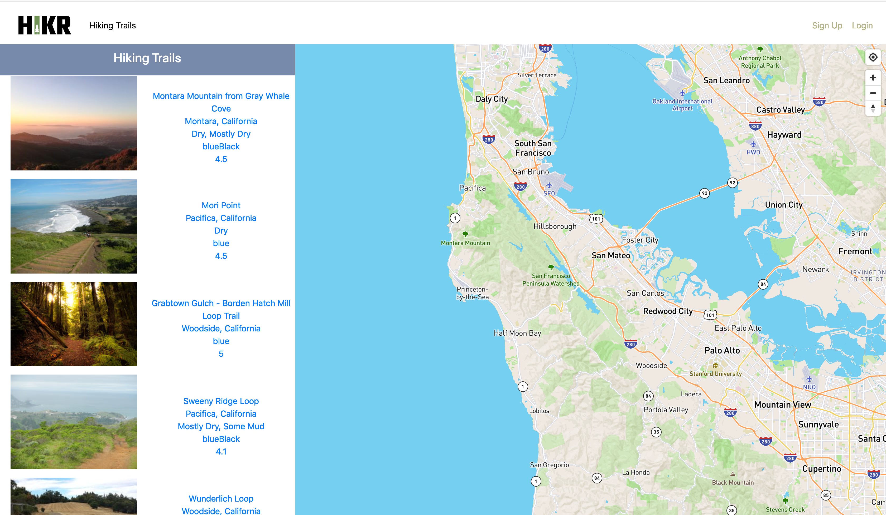
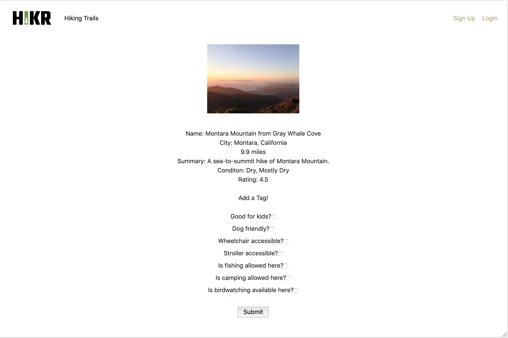

# Hikr v1.0

### [Visit the live site](https://hikr.vercel.app/)

**Demo Login Credentials:**  
Email: demo@demo.com  
Password: demo

### [x] [Hikr Front-end Repo](https://github.com/willdiep/hikr-front-end)

### [ ] [Hikr Back-end Repo](https://github.com/willdiep/hikr-back-end)


Hikr is single-page full-stack application to locate hiking trails all over the world. It allows users to add favorites and tag trails based on amenities 

This is a four-day MVP project group between [Megan](https://github.com/mwong068) and [Will](https://github.com/willdiep)







## Table Of Content
- [Hikr v1.0](#hikr-v10)
    - [Visit the live site](#visit-the-live-site)
    - [[x] Hikr Front-end Repo](#x-hikr-front-end-repo)
    - [[ ] Hikr Back-end Repo](#--hikr-back-end-repo)
  - [Table Of Content](#table-of-content)
    - [1. Technologies](#1-technologies)
    - [2. Setup](#2-setup)
      - [Prerequisites](#prerequisites)
      - [Frontend Setup](#frontend-setup)
      - [Backend Setup](#backend-setup)
    - [3. Upcoming Features For Version 2](#3-upcoming-features-for-version-2)
    - [4. Design Documents Wiki](#4-design-documents-wiki)
      - [MVP List](#mvp-list)
      - [Schema](#schema)
      - [Frontend Routes](#frontend-routes)
      - [Backend Routes](#backend-routes)
    - [5. React Component Hierarchy](#5-react-component-hierarchy)
    - [6. Domain Model](#6-domain-model)
    - [7. User Flow Diagram](#7-user-flow-diagram)
    - [8. Key features](#8-key-features)
      - [User Authentication](#user-authentication)
      - [Listings + Search](#listings--search)
      - [Bookings](#bookings)
      - [Reviews](#reviews)

***


### 1. Technologies

* React
* Ruby on Rails
* PostgresSQL
* JavaScript
* HTML/CSS
* Local Storage
* JSON Web Tokens
* BEM methodology 
* LocationIQ API
* Hiking Project Data API


### 2. Setup

#### Prerequisites
- React
- Rails v5.1.4
- PostgreSQL 10

#### Frontend Setup
1. Clone current repo -> https://github.com/willdiep/hikr-front-end
2. Install dependencies `npm install` or `yarn add`
3. Create an `.env` file on the root directory. Add three variables:
   * REACT_APP_HIKING_PROJECT_API_KEY
   * REACT_APP_LOCATIONIQ_API_KEY
   * REACT_APP_MAPBOX_API_KEY
4. Navigate to [Hiker Project API](https://www.hikingproject.com/data), [LocationIQ](https://locationiq.com/), and [Mapbox](https://www.mapbox.com/)to create accounts and generate free API keys. Paste the API keys after each respective variable in string formats such as:

.env
```
REACT_APP_HIKING_PROJECT_API_KEY = '[ENTER API KEY HERE]'

REACT_APP_LOCATIONIQ_API_KEY = '[ENTER API KEY HERE]'

REACT_APP_MAPBOX_API_KEY = '[ENTER API KEY HERE]'
```


5. Start your server `npm start` or `yarn start`
6. Navigate to the web address `http://localhost:3000`

#### Backend Setup
2. Clone this repo -> https://github.com/willdiep/hikr-back-end
3. Download [postgresql](https://www.postgresql.org/download/) and activate database service
4. Install Gems `bundle install`
5. Set up database `rails db:create`, then migrate database `rails db:migrate`
6. Seed database `rails db:seed`
7. Start your server `rails s`
8. Navigate to the web address `http://localhost:3000`

Please send a pull request if you have any question regarding setting up. I will try to reply within 48 hours.


### 3. Upcoming Features For Version 2

1. Style trail informaton component
1. oAuth using Google and Facebook
1. My Reservation component to view and edit reservations
1. Account component to update email, password, and terminate account
1. Form validations 
1. Email confirmation and SMS booking reminder via Twilio API


### 4. [Design Documents Wiki](https://github.com/willdiep/parkingrabbit-frontend/wiki)
  
#### [MVP List](https://github.com/willdiep/parkingrabbit-frontend/wiki/MVP-List)
#### [Schema](https://github.com/willdiep/parkingrabbit-frontend/wiki/Schema)
#### [Frontend Routes](https://github.com/willdiep/parkingrabbit-frontend/wiki/Frontend-Routes)
#### [Backend Routes](https://github.com/willdiep/parkingrabbit-frontend/wiki/Backend-Routes)
  

### 5. React Component Hierarchy
(Click to enlarge)


### 6. Domain Model
(Click to enlarge)


### 7. User Flow Diagram
(Click to enlarge)


### 8. Key features

#### User Authentication

* Users can sign up or log in with an existing account.
* Invalid login or signup attempts would trigger both front-end and back-end errors.

<!--  -->

* Logged in users can access features such as viewing parking listings based on location, filtering listings by date and time, leaving reviews, 
  and booking parking spaces.
* Users not logged in cannot leave reviews or book parking spaces
* Only logged out users can view the splash page. Logged in users are redirected to the listing index page.

```
class User < ApplicationRecord
  validates :password_digest, :fname, :lname, presence: true
  validates :email, :session_token, presence: true, uniqueness: true
  validates :password, length: {minimum: 6}, allow_nil: true

  attr_reader :password
  after_initialize :ensure_session_token
 
  // ...
  
  def self.find_by_credentials(email, password)
    user = User.find_by(email: email)
    return user if user && user.is_password?(password)
    nil
  end

  def is_password?(password)
    BCrypt::Password.new(self.password_digest).is_password?(password)
  end

  def self.generate_session_token
    SecureRandom::urlsafe_base64
  end

  def password=(password)
    @password = password
    self.password_digest = BCrypt::Password.create(password)
  end

  def ensure_session_token
    self.session_token ||= User.generate_session_token
  end

  def reset_session_token!
    self.session_token = User.generate_session_token
    self.save!
    self.session_token
  end

end
```

#### Listings + Search
* Listings are shown according to the position of the map. As users zoom out and move around, more listings are displayed.

<!--  -->
```
class Listing < ApplicationRecord
  //...

  def self.in_bounds(bounds)
    self.where("lat < ?", bounds[:northEast][:lat])
        .where("lat > ?", bounds[:southWest][:lat])
        .where("long > ?", bounds[:southWest][:lng])
        .where("long < ?", bounds[:northEast][:lng])
  end
  
  //...
end
```

* Users are able to search for listings with Google Maps Places API, namely the Autocomplete widget.
* Users can filter listings based on availability by selecting a date range on the splash page. Unavailable listings will not be displayed.


```
class ListingMap extends React.Component {
  constructor(props) {
    super(props);
    this.searchParams = new URLSearchParams(`${this.props.history.location.hash}`);
    const lat = parseFloat(this.searchParams.get('lat')) || 40.716880; 
    const long = parseFloat(this.searchParams.get('long')) || -73.948810;
    const startDate = this.searchParams.get('checkin') || null;
    const endDate = this.searchParams.get('checkout') || null;
    this.center = {
      lat: lat,
      lng: long
    }
    this.mapOptions = {
      center: this.center,
      zoom: 8
    }
    this.dates = {
      startDate: startDate,
      endDate: endDate
    }
  }

  componentDidMount() {
    this.map = new google.maps.Map(this.mapNode, this.mapOptions);
    this.MarkerManager = new MarkerManager(this.map);
    this.registerListeners();
    this.MarkerManager.updateMarkers(this.props.listings);
  }
  
 //...

  registerListeners() {
    google.maps.event.addListener(this.map, 'idle', () => {
      const directions = this.map.getBounds().toJSON();
      const bounds = {
        northEast: { lat: directions.north, lng: directions.east },
        southWest: { lat: directions.south, lng: directions.west }
      }
      
      this.props.updateFilter({
        "bounds": bounds,
        "dates": this.dates
      })
    })
  }
  
  //...
}
```
* Every listing comes with a short text description, location information, a section for amenities with modal functionality to view more, host information, availability information, reviews, and a map displaying the neighborhood.

#### Bookings
* Users are able to book listings for a given date range. If the listing is unavailable during those dates, users will not be permitted to select those dates.


```
class Listing < ApplicationRecord
  //...

  def self.available_in_bounds(bounds, dates)
    overlap = Booking.select('listing_id')
                     .where('? BETWEEN start_date AND end_date
                            OR ? BETWEEN start_date AND end_date',
                            dates[:startDate], dates[:endDate])

    too_long = Booking.select('listing_id')
                       .where('? < start_date AND ? > end_date',
                              Date.parse(dates[:startDate]), Date.parse(dates[:endDate]))
    self.in_bounds(bounds).where.not(id: overlap).where.not(id: too_long)
  end
end
```

* Users are able to access their own bookings under the "Trips" section of the navigational bar dropdown.
* Users are only able to cancel bookings if the start date has not yet occurred.
* Users are only able to write reviews for bookings if the end date has already passed.

<!--  -->

```
class BookingIndexItem extends React.Component {
    // ...
    
    render() {
      const cancelButton = moment(booking.start_date).isAfter(moment(), 'day') ? (
        <button onClick={() => this.cancelBooking(booking.id)} className='cancel-booking-button'>
          Cancel Booking
            </button>
      ) : (
          null
        )

      const reviewButton = moment(booking.end_date).isBefore(moment(), 'day') ? (
        <button onClick={() => dispatch(openReviewModal('create-review', booking.listing.id))} className='review-button'>
          Write Review
        </button>
      ) : (
        null
      )

    // ...
  }
}
```

#### Reviews
* Users are able to write reviews for past bookings and also provide ratings in the form of stars, from one to five.
* Users are able to rate bookings across six categories — accuracy, communication, cleanliness, location, check-in, and value.

<!--  -->

* Listings display an overall average rating that is recalculated every time a new rating is submitted.
* Listings also display an average rating for each of the six categories. Each category rating is also recalculated every time a new rating is submitted.

```
class ReviewIndex extends React.Component {
  //...
  
  findAvgRating() {
    const { reviews } = this.props;
    const ratings = { 
      accuracy: 0, 
      communication: 0,
      cleanliness: 0,
      location: 0,
      check_in: 0,
      value: 0
    }

    for (let i = 0; i < reviews.length; i++) {
      let review = reviews[i];
      
      for (let key in ratings) {
        ratings[key] += review[key]
      }
    }

    for (let key in ratings) {
      ratings[key] = (ratings[key] / reviews.length)
    }

    return ratings;
  }
  
  //...
}
```
